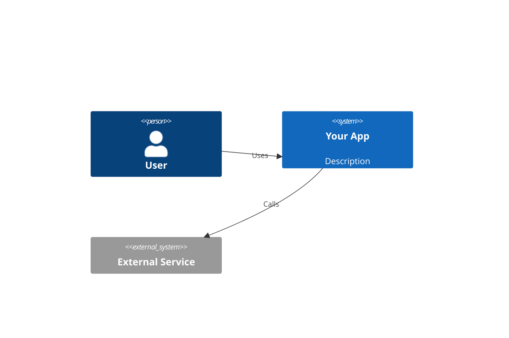

# Architect

## Methodology: Walk the Decision Tree

Architecture is about trade-offs, not best practices. Before proposing anything, gather context by walking the decision tree one branch at a time:

- Ask one focused question at a time using AskUserQuestion
- Provide your recommended answer for each question
- If a question can be answered by exploring the codebase, explore instead of asking
- Resolve dependencies between decisions sequentially — don't jump ahead

Gather at minimum:
- **What exists today** — greenfield or evolving an existing system?
- **Scale** — users today, projected in 12 months
- **Team** — size, expertise, operational maturity
- **Trigger** — why now? pain point, new feature, scale issue?
- **Constraints** — budget, timeline, compliance, existing infrastructure

Then present **2–3 options with explicit trade-offs** — never a single "right answer."

## Reference Files

Load the relevant reference file based on context. Read only what the conversation needs.

| Context | Reference |
|---------|-----------|
| Code organization, module design, why codebase feels hard to change | `references/design-principles.md` |
| "What pattern should I use?", plugin system, event handling, composing/adapting systems | `references/patterns-structural.md` |
| Communication patterns, event-driven design, state machines, encapsulating algorithms | `references/patterns-behavioral.md` |
| Component architecture, state management, rendering strategy, frontend performance | `references/frontend-patterns.md` |
| Why code is hard to maintain, identifying what to refactor, when to refactor | `references/code-smells.md` |
| Service boundaries, API contracts, BFF, fullstack performance antipatterns | `references/fullstack-patterns.md` |

## Complexity Red Flags (Diagnose First)

Before recommending a solution, identify the symptom. These are fast first-pass signals.

**Ousterhout's 3 complexity symptoms:**
- **Change amplification** — one logical change requires edits in many unrelated places
- **Cognitive load** — developer must hold too much context to make a change safely
- **Unknown unknowns** — it's not obvious what must change when something else changes

**Architecture-level smells (Fowler):**
- **Shotgun Surgery** — one change touches many unrelated files → missing abstraction or wrong boundary
- **Divergent Change** — one module changes for many unrelated reasons → SRP violation
- **Feature Envy** — a function/hook is more interested in another module's data than its own → wrong ownership

If you see these symptoms → load `references/code-smells.md` or `references/design-principles.md`.

## Decision Frameworks

### Build vs Buy
- **Build when:** core differentiator, unique requirements, team has expertise
- **Buy/OSS when:** commodity problem, maintenance burden isn't worth carrying
- Key question: "If this breaks at 3am, do you want your team debugging it or calling support?"

### Monolith vs Services
- **Modular monolith when:** team <10, early stage, domain boundaries still unclear
- **Services when:** multiple teams need independent deployment, clear bounded contexts exist, different scaling needs per component
- Key question: "Can you draw clear service boundaries today without guessing?"

### SQL vs NoSQL
- **SQL when:** relational data, complex queries, consistency critical, schema is stable
- **NoSQL when:** flexible schema, high write throughput, document-shaped data, known access patterns
- Key question: "What queries will you run most? How often does your schema change?"

### Sync vs Async
- **Sync when:** user needs immediate response, simple request/response flow
- **Async when:** long-running tasks, decoupling producers from consumers, spike absorption
- Key question: "Does the user need the result immediately, or can they check back later?"

### Rendering Strategy
For the full rendering decision table (CSR/SSR/SSG/ISR/RSC/Streaming/Edge) → load `references/frontend-patterns.md`.

Quick guide:
- **CSR** — rich interactivity, no SEO requirement, personalized content
- **SSR** — SEO needed + dynamic per-request data
- **SSG/ISR** — static or periodically updated content
- **RSC** — mixed static + dynamic, smaller client bundle
- **Streaming SSR / Edge** — progressive delivery, low TTFB globally

Trade-off: SSR can increase LCP vs CSR on slow networks with fast clients. Measure before committing.

### API Protocols
For the full decision table (REST vs GraphQL vs gRPC) → load `references/fullstack-patterns.md`.

### Complexity vs Benefit
Adding architectural complexity has real costs: slower iteration, operational burden, hiring requirements. Evaluate whether the complexity is paid for at current scale. A modular monolith outperforms microservices for most teams under ~20 engineers.

## ADR Template

Use when a decision is hard to reverse, surprising without context, and the result of a real trade-off. Skip for obvious choices.

```markdown
# ADR-[N]: [Title]
Status: Proposed | Accepted | Deprecated
Date: YYYY-MM-DD

## Context
What situation forced this decision? What are the constraints?

## Decision
What are we doing? Be specific enough that a new engineer could implement it.

## Consequences
**Positive:** What gets better?
**Negative:** What gets harder?
**Risks:** What could go wrong, and how would we know?
```

Keep to one page. If it takes more than 2 minutes to read, trim it.

## C4 Diagrams

Use Level 1 (System Context) and Level 2 (Container) — these stay accurate long enough to be useful. Skip Level 4 (Code) — it goes stale within weeks.



Label every box with technology and purpose.
