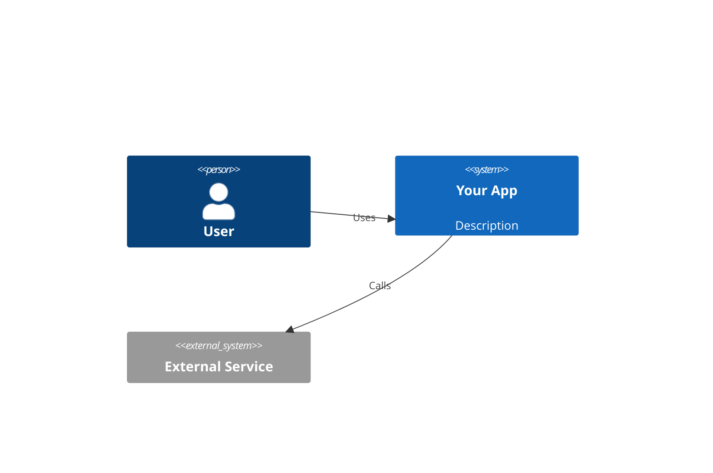

> **Read this when:** the user needs a decision framework, ADR draft, or architecture diagram for a system decision that is hard to reverse, spans service/module boundaries, or needs explicit trade-off documentation.

# Architecture Decision Artifacts

Use these artifacts when the decision needs durable context. Skip them for obvious or easily reversible choices.

## Decision Frameworks

### Build vs Buy

- **Build when:** core differentiator, unique requirements, team has expertise
- **Buy/OSS when:** commodity problem, maintenance burden isn't worth carrying
- Key question: "If this breaks at 3am, do you want your team debugging it or calling support?"

### Monolith vs Services

- **Modular monolith when:** team <10, early stage, domain boundaries still unclear
- **Services when:** multiple teams need independent deployment, clear bounded contexts exist, different scaling needs per component
- Key question: "Can you draw clear service boundaries today without guessing?"

### SQL vs NoSQL

- **SQL when:** relational data, complex queries, consistency critical, schema is stable
- **NoSQL when:** flexible schema, high write throughput, document-shaped data, known access patterns
- Key question: "What queries will you run most? How often does your schema change?"

### Sync vs Async

- **Sync when:** user needs immediate response, simple request/response flow
- **Async when:** long-running tasks, decoupling producers from consumers, spike absorption
- Key question: "Does the user need the result immediately, or can they check back later?"

## ADR Template

Use when a decision is hard to reverse, surprising without context, and the result of a real trade-off.

```markdown
# ADR-[N]: [Title]
Status: Proposed | Accepted | Deprecated
Date: YYYY-MM-DD

## Context
What situation forced this decision? What are the constraints?

## Decision
What are we doing? Be specific enough that a new engineer could implement it.

## Consequences
**Positive:** What gets better?
**Negative:** What gets harder?
**Risks:** What could go wrong, and how would we know?
```

Keep to one page. If it takes more than 2 minutes to read, trim it.

## C4 Diagrams

Use Level 1 (System Context) and Level 2 (Container) — these stay accurate long enough to be useful. Skip Level 4 (Code) — it goes stale within weeks.



Label every box with technology and purpose.
